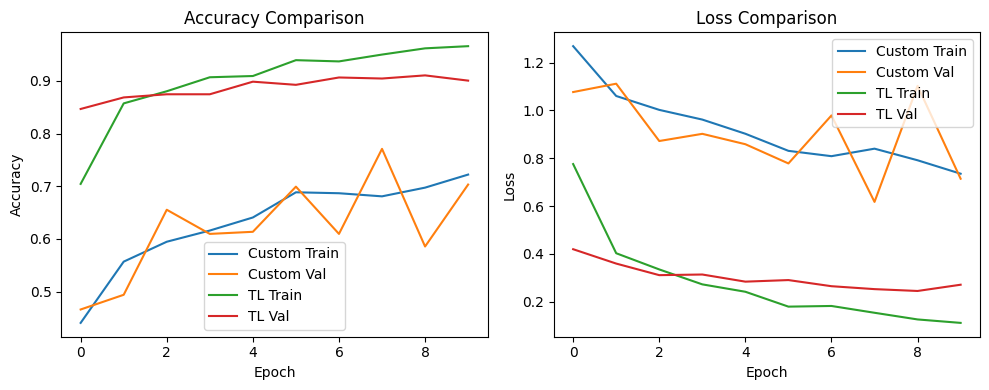

# 🧠Brain Tumor MRI Image Classification

A comprehensive end-to-end pipeline for brain tumor MRI classification using deep learning techniques. This project combines the power of a Custom Convolutional Neural Network (CNN) and Transfer Learning via MobileNetV2, providing a robust approach to tumor detection with real-time deployment through a Streamlit web application.

## 📊 Dataset Information

This project utilizes a labeled MRI brain tumor dataset specifically created for the detection and classification of brain tumor types. The dataset has been carefully curated and labeled by medical experts to ensure high-quality training data.

### 📈 Dataset Overview
- **Total Images** - 2,443 MRI scans
- **Image Type** - High-resolution MRI brain scans
- **Medical Expert Validation** - All images labeled using standardized protocols

### 🏷️ Classification Categories
The dataset includes four distinct classes -
1. **Pituitary Tumor** - Tumors affecting the pituitary gland
2. **Meningioma Tumor** - Tumors arising from the meninges
3. **Glioma Tumor** - Tumors originating from glial cells
4. **No Tumor** - Healthy brain tissue (control cases)

### 📂 Data Distribution
| Dataset Split | Number of Images | Percentage |
|---------------|------------------|------------|
| **Training Set** | 1,695 | 69.4% |
| **Validation Set** | 502 | 20.5% |
| **Test Set** | 246 | 10.1% |
| **Total** | 2,443 | 100% |

### 🔬 Labeling Protocol
- **Expert Annotation** - Images labeled by qualified medical professionals
- **Standardized Protocol** - Consistent labeling methodology across all images
- **Comprehensive Labels** - Include both tumor type and anatomical location
- **Quality Assurance** - Multi-level review process for label accuracy

### 🎯 Clinical Applications
This dataset enables several important medical AI applications -

**🏥 Diagnostic Assistance**
- Automated brain tumor classification to support radiologist workflows
- Second-opinion systems for complex cases
- Screening tools for early tumor detection

**🔬 Research & Development**
- Training machine learning models for medical image analysis
- Development of new diagnostic algorithms
- Comparative studies of different tumor types

**💊 Treatment Planning**
- Tumor type identification for personalized treatment protocols
- Monitoring treatment response over time
- Supporting clinical decision-making processes

## 🚀 Features

- **Dual Model Architecture** - Custom CNN and MobileNetV2 transfer learning
- **Complete Pipeline** - From data preprocessing to deployment
- **Interactive Web App** - Real-time predictions via Streamlit
- **Comprehensive Evaluation** - Detailed metrics and visualizations
- **Production Ready** - Model checkpointing and callbacks

## 🔧 Project Pipeline

| Step | Description |
|------|-------------|
| 1️⃣ | **Dataset Upload & Extraction** - MRI image dataset uploaded as ZIP file and programmatically extracted into structured directories |
| 2️⃣ | **Preprocessing & Augmentation** - ImageDataGenerator for rescaling, rotation, zoom and horizontal flipping |
| 3️⃣ | **Custom CNN Construction** - Hand-crafted CNN with increasing filter depth and dropout regularization |
| 4️⃣ | **Model Training with Callbacks** - EarlyStopping and ModelCheckpoint for optimal training |
| 5️⃣ | **Model Evaluation** - Classification accuracy, loss curves, confusion matrix and classification reports |
| 6️⃣ | **Transfer Learning via MobileNetV2** - ImageNet pre-trained weights with custom classification head |
| 7️⃣ | **Model Comparison** - Graphical comparison of both models across training epochs |
| 8️⃣ | **Deployment via Streamlit** - User-friendly web application for real-time MRI scan predictions |

## 🏗️ Model Architectures

### 🔹 Custom CNN
A lightweight, custom-designed CNN model tailored for medical imaging -

- **3 Convolutional Layers** - Each followed by ReLU activation and MaxPooling
- **Flatten Layer** - Converts feature maps into 1D vector
- **Dense Layers** - Fully connected layer with ReLU and 50% Dropout
- **Output Layer** - Softmax activation over 4 tumor categories
- **Input Shape** - (150, 150, 3)
- **Loss Function** - Categorical Crossentropy
- **Optimizer** - Adam

### 🔹 Transfer Learning – MobileNetV2
A deeper, more powerful architecture using pretrained weights -

- **Base Model** - MobileNetV2 with `include_top=False` and frozen weights
- **Global Average Pooling** - Converts 2D feature maps to 1D
- **Dropout Layer** - Regularization to prevent overfitting
- **Dense Output Layer** - Final softmax layer for 4-class classification
- **Input Shape** - (224, 224, 3)
- **Fine-Tuning** - Unfreezing top layers for domain adaptation

## 📊 Model Evaluation & Metrics

Both models are evaluated using -

✅ **Accuracy and Loss Curves** across training epochs  
✅ **Confusion Matrix** for prediction visualization  
✅ **Classification Report** (Precision, Recall, F1-score per class)  
✅ **Validation Metrics** monitored via callbacks  

## 🌐 Streamlit Web Application

Interactive web interface for real-time MRI classification -

### Features - 

- 📤 **Upload MRI Images** - Direct image upload via drag-and-drop
- 🔄 **Model Selection** - Choose between Custom CNN or MobileNetV2
- 📊 **Probability Scores** - View prediction confidence for each tumor class
- 🎯 **Visual Feedback** - Clear prediction results with explanations

### Screenshots -
The application provides an intuitive interface showing -

<p align="center">
  
</p>

<table>
  <tr>
    <td></td>
    <td></td>
  </tr>
  <tr>
    <td></td>
    <td></td>
  </tr>
  <tr>
    <td></td>
    <td></td>
  </tr>
  <tr>
    <td></td>
    <td></td>
  </tr>
</table>

## 🛠️ Tech Stack

| Category | Tools |
|----------|-------|
| **Core Language** | Python 3.7+ |
| **Deep Learning** | TensorFlow, Keras |
| **Web Application** | Streamlit |
| **Data Handling** | NumPy, Pandas |
| **Visualization** | Matplotlib, Seaborn, Plotly |
| **Model Evaluation** | scikit-learn |

## 🚀 Getting Started

### Prerequisites
```bash
pip install tensorflow keras streamlit numpy pandas matplotlib seaborn plotly scikit-learn
```

### Installation
1. Clone the repository -
```bash
git clone https://github.com/iamhriturajsaha/BRAIN-TUMOR-MRI-IMAGE-CLASSIFICATION.git
cd BRAIN-TUMOR-MRI-IMAGE-CLASSIFICATION
```

2. Run the Streamlit app -
```bash
streamlit run app.py
```

## 📈 Results

The project includes comprehensive model comparison with visualization of -
- Training and validation accuracy/loss curves
- Convergence behavior analysis
- Overfitting detection
- Final performance metrics



## 🔮 Future Enhancements

- [ ] **Additional Models** - Support for ResNet50, EfficientNet
- [ ] **Multi-Modal Imaging** - Extend to CT and PET scans
- [ ] **Model Interpretability** - Add Grad-CAM visualization
- [ ] **Production Deployment** - Docker containerization and cloud deployment
- [ ] **Real-time Processing** - Batch processing capabilities
- [ ] **Model Ensemble** - Combine multiple models for improved accuracy
